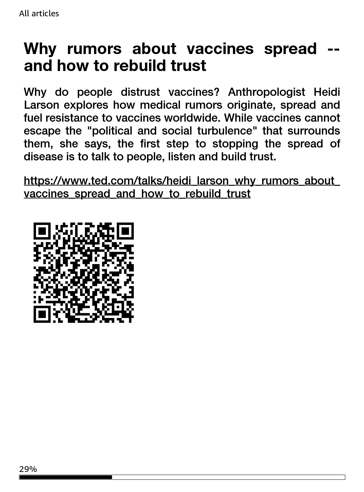
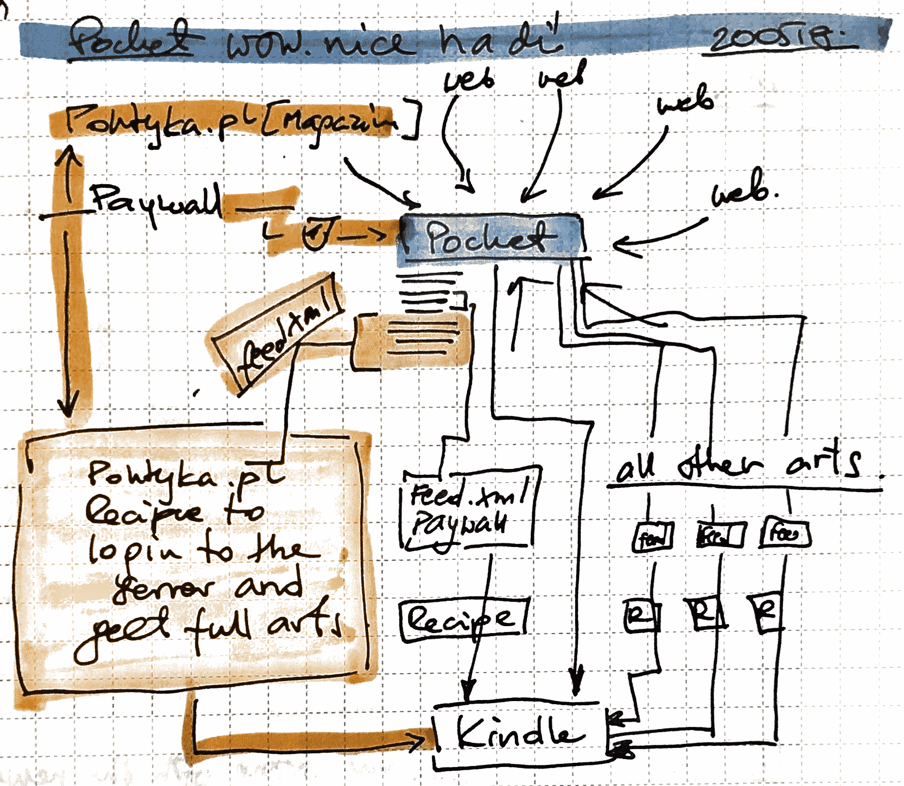
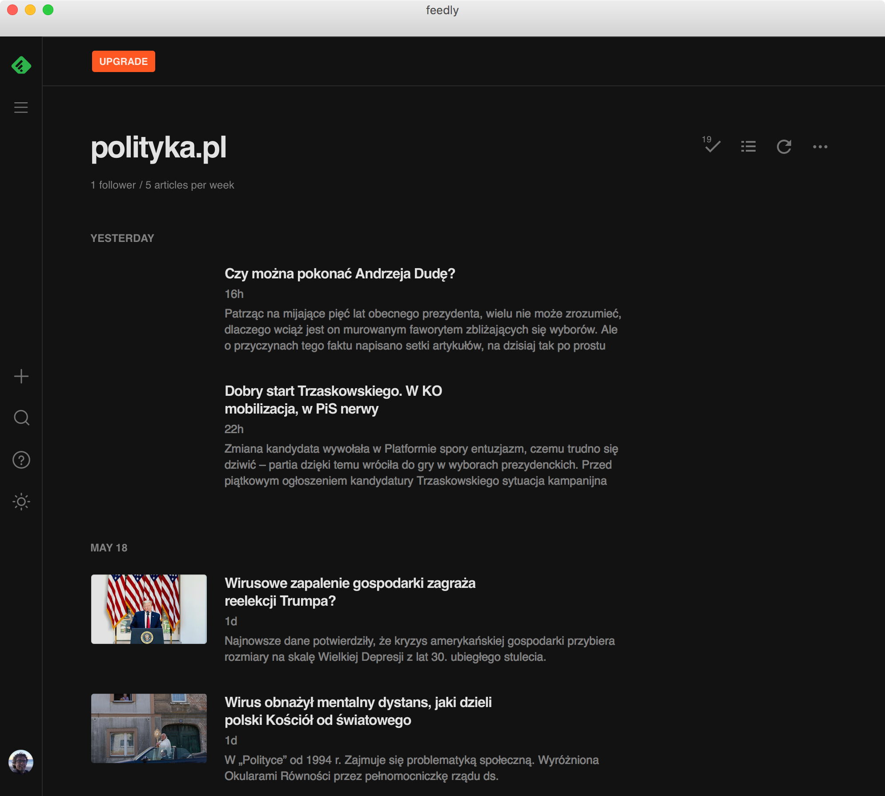
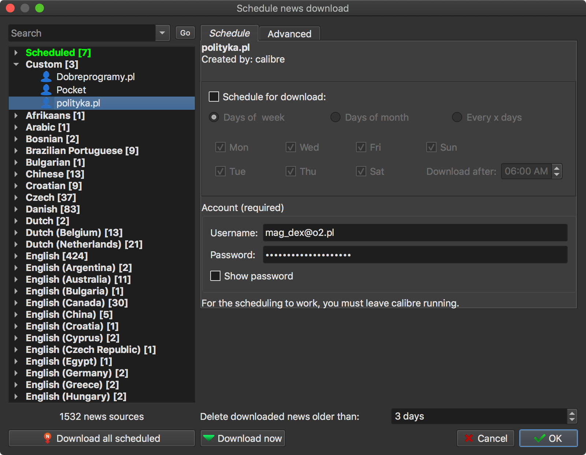
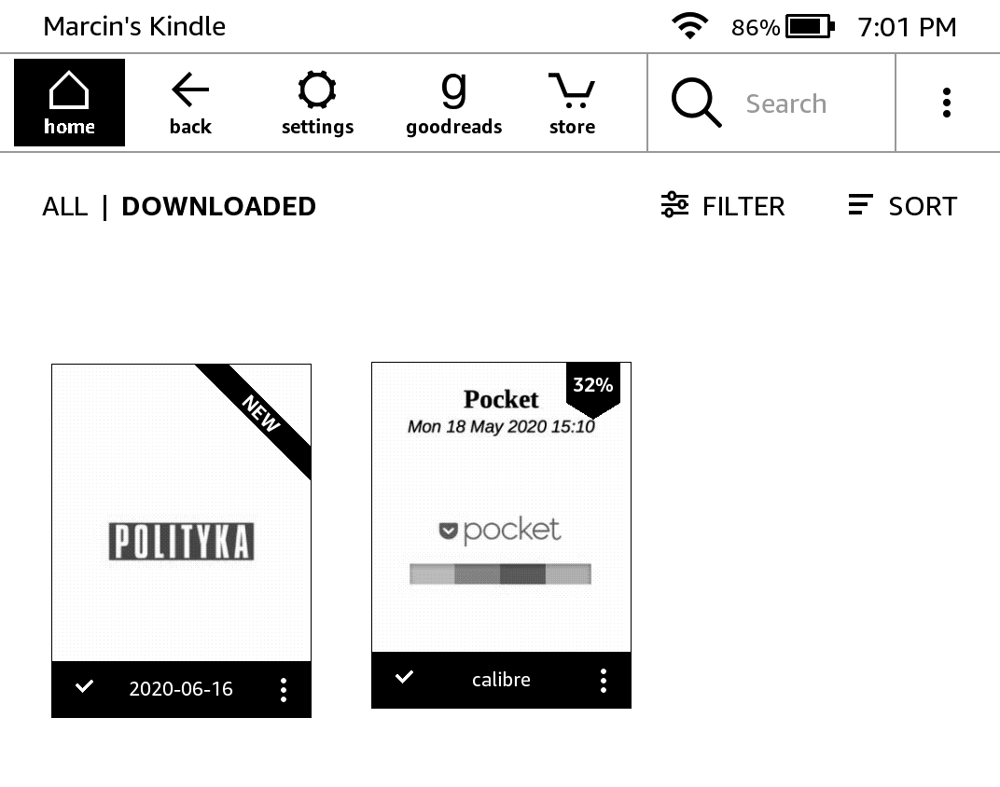

<div align="center">
	
<h1>
PocketX recipe for Calibre
</h1>
	<a href="https://github.com/mmagnus/Pocket-Plus-Calibre-Plugin">PocketX-Calibre-Plugin</a> is an <b style="color:red;">experimental</b> version of <a href="https://github.com/mmagnus/Pocket-Plus-Calibre-Plugin">Pocket-Plus-Calibre-Plugin</a>
</div>

Features tested here:

- add QR and URL to articles for quick access a given content (articles with videos, see color pictures) on your phone or tablet,
- test workflow, PocketX, dealing with articles behind paywalls via creating temporary RSS feeds (this workflow works, but it's not easy to setup)

Table of Contents
=================

* [QR &amp; URL](#qr--url)
* [PocketX](#pocketx)
  * [Motivation](#motivation)
  * [Workflow](#workflow)
  * [Feed](#feed)
  * [Recipes](#recipes)
  * [On Kindle](#on-kindle)
* [Configuration](#configuration)

Created by [gh-md-toc](https://github.com/ekalinin/github-markdown-toc.go)

# QR & URL
One of the feature that is explored here is to the usage of QR codes to get access to a given content on your tablet or iPhone, directly going from your Kindle/Boox.



# PocketX
(cross connectivity)

This version of the plugin will create RSS feeds based on your Pocketed articles so you can use regular Calibre Recipes to access the content (to customize the way how you fetch artciles or to login into paywalled journals).

**This experimental version of the main plugin, still with errors, so use only for testing.**

## Motivation

> I want to keep all my links in one place, Pocket. Howerver, I keep there some journals behind paywall, so I need a way to fetch these artciles. Sometimes PocketX is not able to process the articles correctly, so you might want to create feeds and recipes for various use cases.

## Workflow


**You collect everything to Pocket. (Let's focus on the orange flow) Then you run this PocketX script to create a feed.xml file and you upload it for example to Dropbox. Next, this feed file is fetched by a recipe,e.g., polityka to get login into the journal and get articles behind a paywall. Of course, you can code more than one recipes to process your pocket (depicted as many feeds and many recipes**

##
 PocketX
Configure your feeds in PocketX.recipe:

```python
            feeds = {'polityka':
                               {'feed_fn': '/Users/magnus/Dropbox/feed.xml',
                                'feed_title': 'polityka.pl',
                                'feed_desc': 'polityka.pl',
                                'feed_link': 'http://polityka.pl',
                                'feed_search_url' : 'polityka.pl'},
                     'test':
                               {'feed_fn': '/Users/magnus/Dropbox/test.xml',
                                'feed_title': 'polityka.pl',
                                'feed_desc': 'polityka.pl',
                                'feed_link': 'http://polityka.pl',
                                'feed_search_url' : 'polityka.pl'},
                 }

```

run:

    ebook-convert PocketX.recipe PocketX.mobi

(if you use dropbox for hosting feed files, wait a bit so the feed files will be uploaded to Dropbox)

## Feed
The feed will be created.


```xml
<?xml version="1.0" encoding="UTF-8" ?><rss version="2.0"><channel>
                    <title>polityka.pl</title>
                    <description>polityka.pl</description>
                    <link>http://polityka.pl</link>
                    
                         <item>          
                          <title>Do polityki wchodzi pokolenie. Dla nich przyszłość jest teraz albo wcale</title>
                          <description>Jest trzecią i najmłodszą w historii kobietą na czele fińskiego rządu. Należy do Partii Socjaldemokratycznej, największej w koalicyjnym gabinecie.</description>
                          <link>https://www.polityka.pl/tygodnikpolityka/swiat/1936530,1,ok-boomer.read</link>
                          <pubDate>1589833811</pubDate>
                         </item>

</item></channel></rss>
```


This is a real feed ;-) you can use Feedly to access it.


## Recipes
Example: polityka.recipe with login in into the journal!

Configure the feed:

```python
class polityka(BasicNewsRecipe):
    title          = 'polityka.pl'
    oldest_article = 10000
    max_articles_per_feed = 10000
    
    auto_cleanup   = False

    feeds          = [
        ('polityka.pl', 'http://dl.dropbox.com/s/27t8uhx4nlslggr/feed.xml'), ## your feed here! use dl dropbox link to skip the Dropbox web interface
    ]
```

Run:

    ebook-convert polityka.pl.recipe .mobi --username XXXXXXXXXXX --password XXXXXXXXX --personal-doc true

or run via Calibre:



to get articles from the feed and send it to your Kindle.
## On Kindle


# Configuration

**TAGS** (list of strings or empty list: []) if [] (empty list) then the plugin will connect Pocket and fetch articles based on the configuration of the plugin.
    Next, the plugin will get tags of these articles and group them into sections in the final ebook.
    If TAGS has elements, e.g., TAGS = ['tag1', 'tag2'] then only these tags will be fetched from Pocket.

**TAGS_EXCEPTIONS** (list of strings or empty list: []) if [] (empty list) then the plugin will ignore it.
    If TAGS_EXCEPTIONS has elements, e.g., TAGS_EXCEPTIONS = ['tag3', 'tag4'] then the articles tagged with this tags will be ignored.
    That is, tag3 and tag4 won't appear as sections, and it's articles won't appear in the  "Untagged" section.
    This variable is meant to be used with TAGS = [], as it doesn’t make any sense to specify a tag both in TAGS and in TAGS_EXCEPTIONS.

**INCLUDE_UNTAGGED** (True or False) if True then put all fetched and untagged articles in the last section 'Untagged'.
    If False then skip these articles and don't create the section 'Untagged'. Bear in mind that if TAGS is populated ( e.g. TAGS = ['tag1', 'tag2']),
    INCLUDE_UNTAGED = True and other tags exist in Pokcet (e.g. tag3,tag4) then the Untagged section will include untagged articles 
    in Pocket AND articles tagged with tag3 and tag4. That behavior can be avoided using TAGS_EXCEPTION

**ARCHIVE_DOWNLOADED** (True or False) do you want to archive articles after fetching 

**MAX_ARTICLES_PER_FEED** (number) how many articles do you want to fetch for FEED (FEED could be also 
considered as TAG, so for each TAG you this value will be applied.

**SORT_METHOD** ('oldest' or 'newest') way how the articles are sorted

**OLDEST_ARTICLE** (number) fetch articles added (modified) in Pocket for number of days, 7 will give you articles added/modified in Pocket for the last week 
 
**TO_PULL** ('all' or 'unread') What articles to pull? unread only or all?

**TITLE_WITH_TAGS** (True or False) if True will the ebook filename will be like
    Pocket: INVEST P2P [Sun, 05 Jan 2020] for many tags this might be to long, if you make a single tag ebook this might be super fun!


